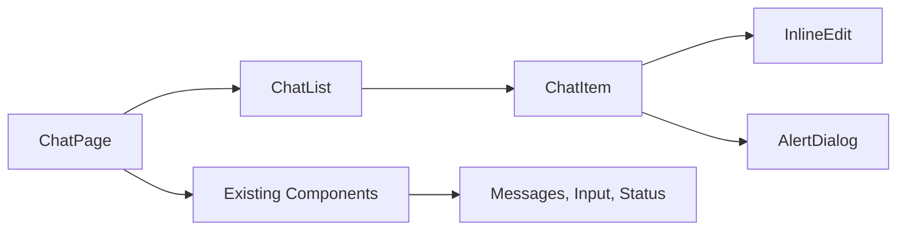

# 🔍 Task Context File: Chat Management Feature

## 📊 **Project Context Analysis**

### **Current System State**
- **Project**: MCP Multi-Agent UI (Next.js 15.4.6, React 19.1.0, TypeScript)
- **Architecture**: Next.js App Router with Radix UI components and Tailwind CSS
- **Current Chat**: Single chat interface with hardcoded conversation list
- **MCP Integration**: Real-time streaming chat with multiple MCP servers
- **Persistence**: Currently no localStorage usage - all state in React components

## 🗂️ **Impacted Files and Modules**

### **🎨 Frontend Components**
```
mcp-agent-ui/src/app/chat/page.tsx          [MAJOR MODIFICATION]
├── Current: Single chat with hardcoded conversations
├── Impact: Integrate useChatManager hook and multi-chat support
└── Risk: High - Core chat functionality

mcp-agent-ui/src/components/chat/           [NEW DIRECTORY]
├── ChatList.tsx                            [NEW COMPONENT]
├── ChatItem.tsx                            [NEW COMPONENT]
└── InlineEdit.tsx                          [NEW COMPONENT]

mcp-agent-ui/src/components/ui/             [MINOR ADDITION]
├── inline-edit.tsx                         [NEW COMPONENT]
└── Existing components (Dialog, AlertDialog, Button) [REUSE]
```

### **🔧 Hooks and Services**
```
mcp-agent-ui/src/hooks/                     [NEW HOOKS]
├── use-chat-manager.ts                     [NEW HOOK]
├── use-local-storage.ts                    [NEW HOOK]
└── Existing hooks (use-mcp-status.ts, use-mcp-servers.ts) [REFERENCE]

mcp-agent-ui/src/lib/                       [NEW SERVICE]
├── chat-storage-service.ts                 [NEW SERVICE]
└── Existing services (mcp-config-service.ts) [PATTERN REFERENCE]
```

### **📝 Types and Interfaces**
```
mcp-agent-ui/src/types/                     [NEW TYPES]
├── chat.ts                                 [NEW TYPE FILE]
└── Existing types (mcp.ts)                 [REFERENCE]
```

### **🔌 API Routes**
```
mcp-agent-ui/src/app/api/                   [OPTIONAL ENHANCEMENT]
├── chats/route.ts                          [FUTURE API]
├── chats/[id]/route.ts                     [FUTURE API]
└── Existing routes (chat/route.ts)         [MAINTAIN]
```

## 🔗 **Dependencies Mapping**

### **Frontend → Backend Dependencies**
```mermaid
graph TD
    A[Enhanced ChatPage] --> B[useChatManager Hook]
    B --> C[ChatStorageService]
    C --> D[useLocalStorage Hook]
    D --> E[Browser localStorage]
    
    A --> F[Existing MCP Streaming]
    F --> G[/api/chat endpoint]
    G --> H[MCPChatService]
```

### **Component Dependencies**


### **State Flow Dependencies**
```
localStorage ↔ ChatStorageService ↔ useChatManager ↔ ChatPage Components
                                    ↓
                            Existing Message State
                                    ↓
                            MCP Streaming Service
```

## 🏗️ **Current Architecture Patterns**

### **✅ Established Patterns to Follow**

#### **1. Component Architecture**
- **Radix UI Integration**: All UI components use Radix primitives
- **Tailwind Styling**: Utility-first CSS with dark theme consistency
- **TypeScript**: Comprehensive type safety with interfaces and generics
- **Component Structure**: Compound components with clear prop interfaces

#### **2. State Management**
- **Custom Hooks**: Business logic encapsulated in reusable hooks
- **React State**: useState and useEffect for component-level state
- **Ref Management**: useRef for DOM references and stable values
- **Memoization**: useMemo and useCallback for performance optimization

#### **3. Data Services**
- **Class-based Services**: MCPConfigService pattern for data operations
- **Error Handling**: Try/catch blocks with console logging
- **Type Safety**: Full TypeScript integration with Zod validation
- **Async Operations**: Promise-based with proper error propagation

#### **4. API Structure**
- **Next.js App Router**: Route handlers in app/api/ directory
- **Validation**: Zod schemas for request/response validation
- **Error Responses**: Consistent error format with status codes
- **TypeScript**: Full type safety for API contracts

### **🎨 UI/UX Patterns**
- **Dark Theme**: `bg-[#1E1E1E]`, `bg-gray-800`, `text-gray-300`
- **Interactive Elements**: Hover states, focus rings, smooth transitions
- **Loading States**: Spinner animations and disabled states
- **Error States**: Alert components with descriptive messages
- **Responsive Design**: Mobile-first with Tailwind breakpoints

### **🔄 Data Flow Patterns**
- **Unidirectional Flow**: Props down, events up
- **Event Handling**: useCallback for stable event handlers
- **Side Effects**: useEffect with proper dependency arrays
- **Error Boundaries**: Graceful error handling at component level

## 📋 **Integration Analysis**

### **🔌 MCP Integration Points**

#### **Existing MCP Flow**
```typescript
// Current message flow
ChatPage → handleSubmit → /api/chat → MCPChatService → MCP Servers
                                    ↓
                           Streaming Response → UI Update
```

#### **Enhanced MCP Flow**
```typescript
// Enhanced with chat management
ChatPage → useChatManager → handleSubmit → /api/chat → MCPChatService
    ↓                           ↓
ChatStorageService         Streaming Response → UI Update + Chat Save
    ↓
localStorage
```

### **🗄️ Storage Integration Points**

#### **Current Storage**
- **No Persistence**: All chat data lost on page refresh
- **Hardcoded Data**: Static conversation list in component state
- **Session Only**: Messages exist only during browser session

#### **Enhanced Storage**
- **localStorage**: Client-side persistence with structured data
- **Cross-tab Sync**: Storage events for multi-tab consistency
- **Data Migration**: Convert existing hardcoded conversations
- **Expiry Management**: Automatic cleanup of old chats

### **🎯 State Integration Points**

#### **Current State**
```typescript
// Existing state in ChatPage
const [messages, setMessages] = useState<ChatMessage[]>([...])
const [conversations, setConversations] = useState<Conversation[]>([...])
const [input, setInput] = useState('')
const [isLoading, setIsLoading] = useState(false)
```

#### **Enhanced State**
```typescript
// Enhanced state with chat management
const {
  chats,
  currentChat,
  createChat,
  switchToChat,
  updateChatName,
  deleteChat
} = useChatManager()

// Existing state maintained
const [input, setInput] = useState('')
const [isLoading, setIsLoading] = useState(false)
```

## 🎛️ **Configuration Context**

### **📦 Dependencies Available**
- **UI Framework**: Radix UI (Dialog, AlertDialog, Button, etc.)
- **Styling**: Tailwind CSS with custom dark theme
- **Icons**: Lucide React for consistent iconography
- **Validation**: Zod for schema validation
- **State**: React hooks with TypeScript support

### **🔧 Build Configuration**
- **Next.js**: 15.4.6 with App Router and Turbopack
- **TypeScript**: Strict mode with comprehensive type checking
- **Tailwind**: v4 with custom configuration
- **ESLint**: Configured for Next.js and TypeScript

### **🌐 Environment Context**
- **Target**: Modern browsers with localStorage support
- **Compatibility**: React 19.1.0 with concurrent features
- **Performance**: Optimized for real-time streaming
- **Accessibility**: WCAG compliance requirements

## 🔍 **Technical Constraints**

### **✅ Requirements**
- **Maintain Compatibility**: All existing MCP functionality must work unchanged
- **Type Safety**: Full TypeScript integration required
- **Performance**: No degradation of existing chat performance
- **Accessibility**: Keyboard navigation and screen reader support
- **Responsive**: Mobile-friendly touch interactions

### **⚠️ Limitations**
- **localStorage Only**: No server-side persistence in initial version
- **Single User**: No multi-user or sharing functionality
- **Browser Storage**: Subject to localStorage size and availability limits
- **Client-side Only**: No backup or sync across devices

### **🚫 Restrictions**
- **No Breaking Changes**: Existing API contracts must remain unchanged
- **No External Dependencies**: Use existing dependency stack only
- **No Style Changes**: Maintain existing dark theme and visual consistency
- **No Performance Impact**: Streaming performance must be preserved

## 🎯 **Success Integration Criteria**

### **✅ Functional Integration**
1. **Seamless Chat Switching**: No interruption of ongoing conversations
2. **Message Persistence**: All messages saved automatically to active chat
3. **State Consistency**: UI state synchronized with storage state
4. **Error Recovery**: Graceful handling of localStorage failures

### **✅ Technical Integration**
1. **Type Safety**: No TypeScript errors or any types
2. **Performance**: No measurable impact on message streaming
3. **Memory Management**: Proper cleanup of unused chat data
4. **Cross-tab Sync**: Consistent state across browser tabs

### **✅ UI/UX Integration**
1. **Visual Consistency**: Matches existing design patterns
2. **Interaction Patterns**: Follows established user interaction flows
3. **Accessibility**: Maintains existing accessibility standards
4. **Responsive Behavior**: Works consistently across device sizes

---

*Context Analysis Completed: 2025-01-11*
*Impact Assessment: High complexity, well-defined boundaries*
*Integration Risk: Medium - Clear patterns to follow*
